<p align="center">
  <picture>
    <source media="(prefers-color-scheme: dark)" srcset="docs/logo_dark.gif">
    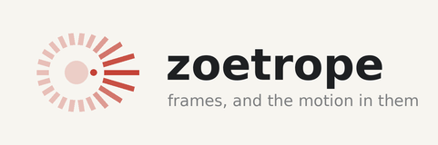
  </picture>
</p>

<p align="center">
  <b>Ask an agent for a video that explains a system — a model you just
  optimized, a paper you just read, a framework you have to teach — and get one
  back where every frame is drawn from a measurement or a citation.</b>
</p>

Text-to-video makes something plausible. This makes something checkable: the
numbers on the screen came off a profiler or out of a paper, the picture is
replayed from timestamps that were really recorded, and a claim with nothing
behind it is printed as `not measured` rather than drawn as a bar.

A zoetrope is a slitted drum with a strip of still drawings inside it. Spin it,
look through the slits, and the stills become one moving thing. Nothing in the
drum moves except the order in which you see it — which is exactly the trick
here: a run writes down *when* each thing happened, and a compositor turns that
list of timestamps into motion.

## Gallery

### Language and vision models

The answer arriving, at the timestamps it really arrived at. Two chapters in
one film: a 35B mixture-of-experts writing a CUDA kernel three ways, and then
*the same model on prose, where the draft stops paying* — because the
speculative arm that wins on code loses on an explanation, and a film that
showed only the first half would be selling.

<p align="center">
  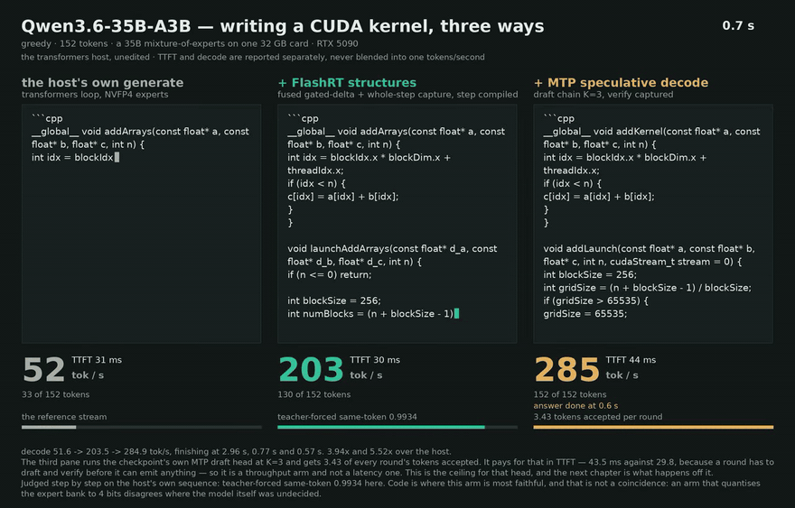
</p>

A vision model gets the picture it was looking at in its own pane. Every pane
carries how far its answer agreed with the reference stream — `agrees with the
host for 291 of 296`, `agrees for 77 tokens, then a synonym`. Two panes
showing different text owe the reader that, and it is exactly the line a demo
is tempted to leave out.

<p align="center">
  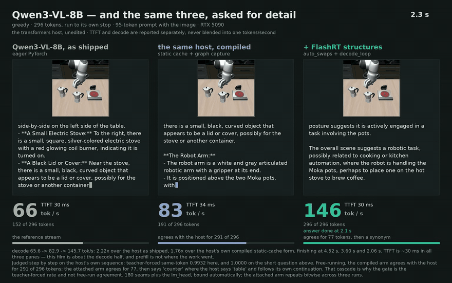
</p>

Both films above are played at half rate, and say so in their own headers —
the fast arm finishes in 0.6 s of model time, which at model rate is a blink.
The clock always reads model time; a film that quietly ran fast or slow
without saying so would be a number nobody can trust.

Both are multi-chapter specs that ship in `examples/specs/`, so they redraw
with no GPU:

```bash
zoetrope draw --spec examples/specs/q35_spec.json --speed 0.5 --out llm.webm
zoetrope draw --spec examples/specs/vl_spec.json  --speed 0.5 --out vlm.webm
```

### Explaining a paper

The mechanism its own authors put at the centre of the design — and, on the
same page, the number it produces. The chart beside a diagram is derived from
that diagram, so the picture and the figure cannot drift apart.

<p align="center">
  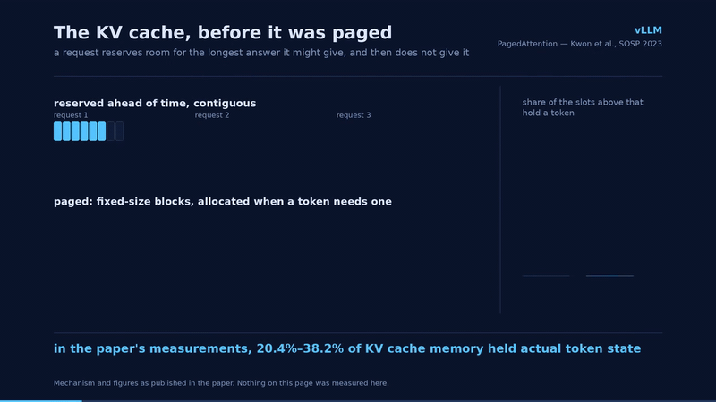
</p>

<p align="center">
  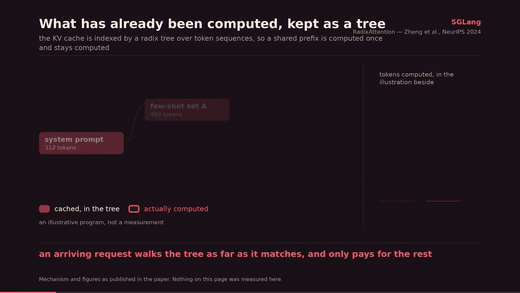
</p>

<p align="center">
  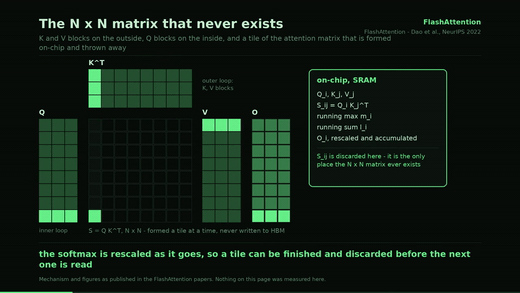
</p>

<p align="center">
  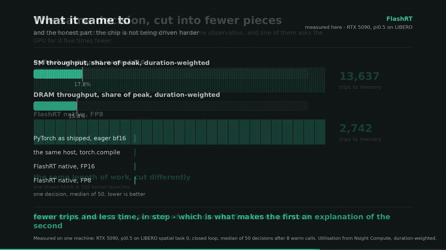
</p>

### Simulation and robots

A policy in closed loop, drawn from the simulator's own camera and the
policy's own control rate — not a screen recording. Three complete pi0.5
rollouts of the same LIBERO task from the same initial state, each one running
to the moment the task is done: 107.5 ms a decision, then 58.9 under
`torch.compile`, then 25.6 — 9.3 Hz, 17.0 Hz, 39.1 Hz, finishing at 13.7 s,
10.2 s and 6.7 s.

<p align="center">
  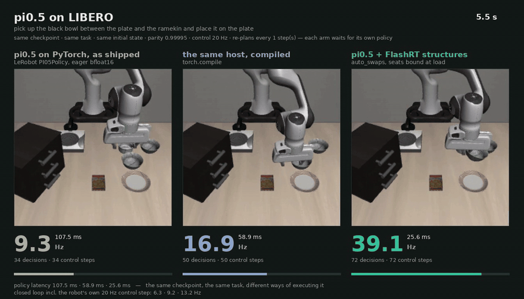
</p>

Whole episodes, at the resolution they were recorded at, in about a megabyte:
frames ship as an animated WebP, because the same three rollouts as raw pixels
are 54 MB. The footer carries the closed-loop rate too, since the robot's own
20 Hz control step is a large part of the wall clock.

### Comparisons

A diffusion model against itself, and the harder question underneath: *why* is
one of them faster. That second film is one idea and nothing else — the same
work, cut into a different number of trips to memory.

<p align="center">
  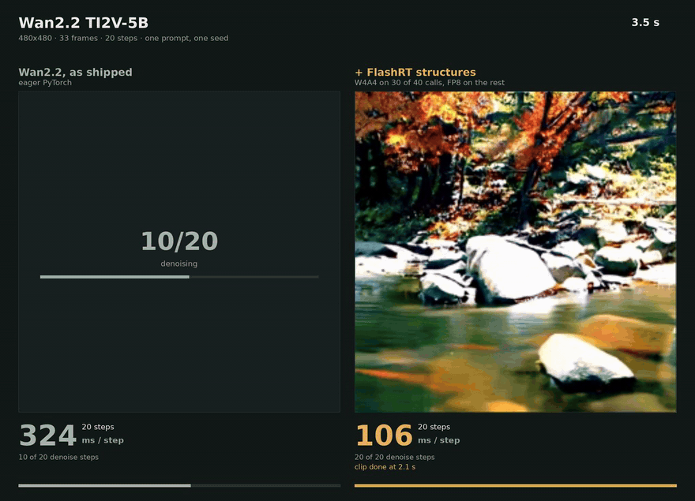
</p>

<p align="center">
  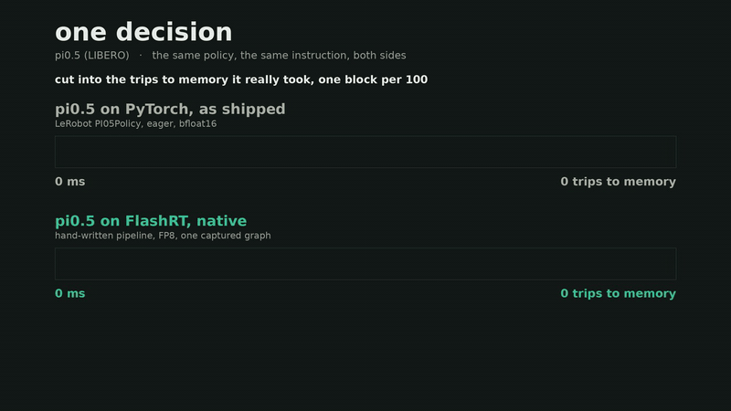
</p>

### Explore more

Every film above is drawn from a recording that ships in this repository, so
each one redraws on your machine with no GPU. They are all painted on the same
1280-wide canvas, whatever they are showing, so a page of them lines up.

Change the ink with one flag and the visual language with another. Below is the
same recording as the first film in this gallery, once in the paper palette and
once drawn as one cell per token — where the argument is not *rate* but *the
same tokens*, and speed is the second thing you notice:

<p align="center">
  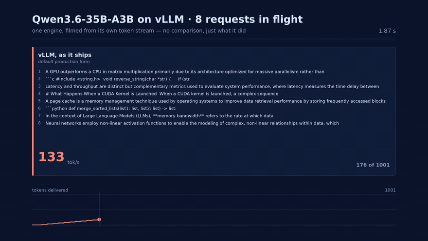
</p>

An engine filmed from its own token stream — eight requests in flight, one
wall clock. One arm, no comparison: this is what the engine did.

<p align="center">
  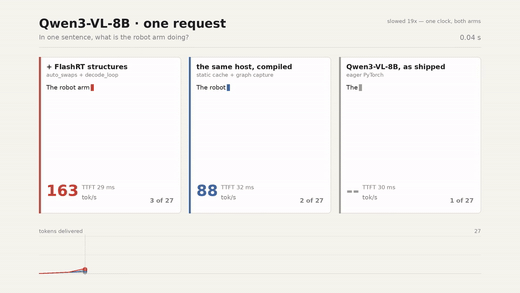
</p>

<p align="center">
  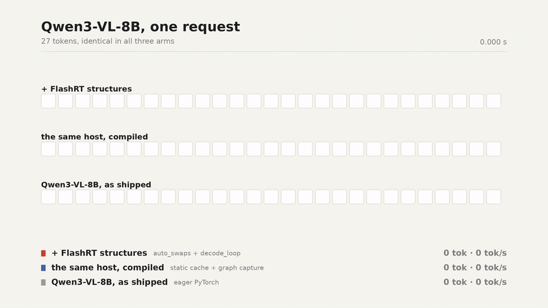
</p>

<p align="center">
  
</p>

```bash
zoetrope live  examples/runs/stream --palette paper --chart curve --out a.webm
zoetrope looks examples/runs/stream --sheet looks.png
```

---

## What you say, and what you get

The whole interface is a sentence. These are real prompts; each one names the
work the agent then does.

| Say this | You get |
|---|---|
| *"Make a demo film from the recordings in this repo."* | Two or more arms writing the same answer on one wall clock, with live tok/s. No GPU — it draws from `events.json`. |
| *"Record my model against `torch.compile` and draw it."* | One process per arm, both timed the same way, both baselines named, headline reported as a median. |
| *"Explain why my version is faster, in one idea."* | The one-idea film: the same work cut into a different number of trips to memory. Everything else cut. |
| *"Explain PagedAttention to someone who has never read the paper."* | A three-page explainer drawn from the paper's own mechanism, each page carrying its citation and the figure it earns. |
| *"Explain this repo's core idea the way you explained vLLM."* | A new spec in `zoetrope/explainers/`, same painters, redrawn in seconds. |
| *"Draw it in every colour system and let me pick."* | One contact sheet, 4 styles × 6 palettes, from the same recording. |
| *"Slower, and hold the ending."* | A pacing change. No model re-run — redrawing costs seconds. |

The last row is the important one. **Recording and drawing are separate.** A
run writes down *when* each thing happened; a compositor replays those
timestamps and paints every frame. Changing the picture never re-runs the
model, so ten drafts is normal and the conversation stays a conversation.

## What the agent will not do

This is the part that makes the output worth showing to other people.

- **It will not invent a number.** A pane with no measurement behind it prints
  `not measured`.
- **It will not report a best-of-N as a headline.** Medians, with min/max as a
  footnote.
- **It will not hide the number that did not move.** FlashRT's own explainer
  puts 17.8% against 20.0% utilisation on the page and says in as many words
  that the chip is not being driven harder — the win is that far less was
  asked of it.
- **It will not silently speed up a clock.** A run too short to watch is
  stretched, and the page says `slowed 18x` on its face.
- **It will not race someone else's framework to make a point.** Explainers
  explain; comparisons belong in a demo where the comparison *is* the subject.

## Install

```bash
pip install -e .
zoetrope skills add          # teach your agent: ~/.claude/skills, ~/.agents/skills
zoetrope skills add --agents-md ~/.codex/AGENTS.md    # Codex reads this instead
```

Two skills go in. `record-a-demo` covers making the film that shows an
optimization worked; `explain-a-speedup` covers the harder one — saying *why* —
and most of it is a record of the versions that failed and the reason each was
unreadable, because that judgement is what a first draft gets wrong.

Then, in Claude Code, Codex, or anything that reads a skills directory:

> Draw the recordings in `examples/runs/stream` as a demo film, in the paper
> palette, and put a tok/s curve under it.

## Two families

### Run demos — drawn from a run

Two arms writing the same answer on one clock. Everybody reads it without
being told anything, and `--chart` puts the shape of it on the page as well.

```bash
zoetrope live examples/runs/stream       --palette paper    --chart curve --out a.webm
zoetrope live examples/runs/stream_batch --palette phosphor --chart bars  --out b.webm
zoetrope live examples/runs/stream       --palette mono     --chart none  --out c.webm
```

One painter covers both shapes: a `stream` arm is one request and its pane is
the answer; a `stream_batch` arm is a serving engine with several requests in
flight and its pane is one scrolling line each.

### Explainers — drawn from a paper

Four ship, and pointing this at a fifth framework is a JSON spec, not a patch.

```bash
zoetrope explain vllm_paged     --menu menu.png              # every panel
zoetrope explain flashattention --palette phosphor --film fa.webm
zoetrope explain sglang_radix   --panel 0 --sheet six.png    # in six palettes
```

| spec | the idea it draws | source |
|---|---|---|
| `vllm_paged` | the KV cache handed out in blocks instead of reserved whole | PagedAttention, SOSP 2023 |
| `sglang_radix` | what has been computed, kept in a tree | RadixAttention, NeurIPS 2024 |
| `flashattention` | the N×N matrix that is never written down | FlashAttention 1 and 2 |
| `flashrt_trips` | fewer, larger kernels — and the utilisation that *did not* move | measured here, RTX 5090 |

Every mechanism page can carry a chart in its right-hand column, and that
chart is **derived from the diagram beside it** — the tokens in the drawn
tree, the queue in the drawn cards — so the picture and its number cannot
drift apart.

## The one rule

**One idea per film, and everything else is cut.**

The corollary is uncomfortable and holds anyway: *more accurate is often
harder to read, and readable wins.* Measure everything; draw one thing.

Five versions of the "why is it faster" film were built and rejected before
the one above. That record — what each version tried and why a person could
not read it — is in
[`.ai/skills/explain-a-speedup/SKILL.md`](.ai/skills/explain-a-speedup/SKILL.md),
and it is the most useful thing in this repository.

## Look

Six colour systems, addressed by role rather than by name, so one flag
restyles a whole film and no drawing code moves:

`midnight` · `paper` · `phosphor` · `blueprint` · `ember` · `mono`

Pages are drawn at twice the size and brought back down — PIL has no
anti-aliasing, and that alone is the difference between a page that looks
designed and one that looks emitted. Beats are eased, lists arrive item by
item, connectors leave and arrive along one axis and curve between, and films
cross-fade rather than cut.

```bash
zoetrope looks examples/runs/stream --sheet looks.png     # 4 styles x 6 palettes
zoetrope logo  logo.gif --palette blueprint --word        # the mark, in any of them
```

The mark at the top of this page is drawn by the same canvas as the films:
a ring of slits where nothing moves except the order in which each one is lit.

## Recording your own

```python
from zoetrope import hook

rec = hook.Recorder("stream", label="+ my change", sub="what it does",
                    color="ours")
with hook.on_tokens(rec, tokenizer):      # stamps each token as it arrives
    model.generate(**inputs, streamer=rec.streamer, max_new_tokens=256)
rec.write("runs/mine/attach")
```

```bash
zoetrope check runs/mine/attach     # names what would fail before you draw
zoetrope live  runs/mine --out mine.webm
```

Other hooks record what the run *did*: `hook.on_kernels` (every CUDA kernel,
via `torch.profiler`, whoever launched it), `hook.on_tree` (the model's own
module tree, and where an optimization's seams landed), `hook.on_components`
(an authored architecture diagram, lit by the entry points a run actually
called).

## Rules the recorders follow

These came from getting them wrong first.

- **One arm per process.** Two arms in one process share allocator state and
  clocks.
- **Warm before you profile.** The first call carries autotune, lazy init and
  graph capture; profiling it once reported 29,000 kernel launches where the
  settled answer was 2,742.
- **Time and profile in separate passes.** A profiler perturbs the run it
  watches.
- **Report TTFT and decode separately.** Never blended into one number.
- **Two baselines**: the host as shipped, and the host after `torch.compile` +
  graph capture. The gate is the compiled one.
- **Headline is a median.** min-of-N is a lower bound, in a footnote.
- **Score parity against the original baseline**, never an intermediate arm.
- **Real inputs.** Random tensors hide calibration bugs.
- **A refusal is a result.** A seam that does not pay is recorded with its
  reason, not dropped.
- **Never estimate what a profiler can measure.** Utilisation derived from
  tensor shapes is off by five to ten times.

## Layout

```
zoetrope/
  hook.py                   the recorders: tokens, kernels, module tree, diagram
  record.py                 one arm per process; --host picks an adapter
  hosts/                    8 host adapters (transformers, diffusers, robot policies)
  pipelines/                recorders for vLLM, SGLang, Wan2.2, Qwen3-VL
  compose/live_compose.py   the run demo: the answer arriving, and its rate
  compose/explain_compose.py a published mechanism, drawn from a spec
  compose/styles_compose.py one recording, four visual languages
  compose/race_compose.py   stream / video / arch / runtime / diagram panes
  compose/canvas.py         the supersampled surface, and the easing
  compose/palettes.py       six colour systems, addressed by role
  compose/logo.py           the mark: a drum of frames, read as motion
  explainers/*.json         the paper specs
  diagrams/*.json           authored architecture layouts, wired to entry points
examples/runs/              20 real recordings; a first cut needs no GPU
.ai/skills/                 record-a-demo, explain-a-speedup
docs/PROTOCOL.md            the run-directory contract and the adapter protocols
```

## License

MIT.
