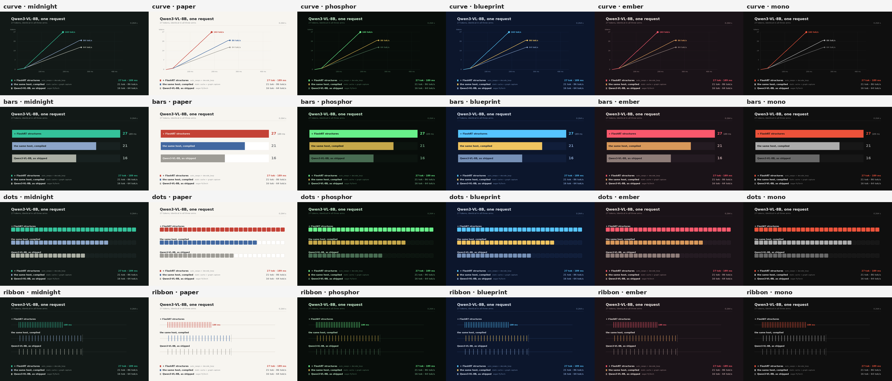
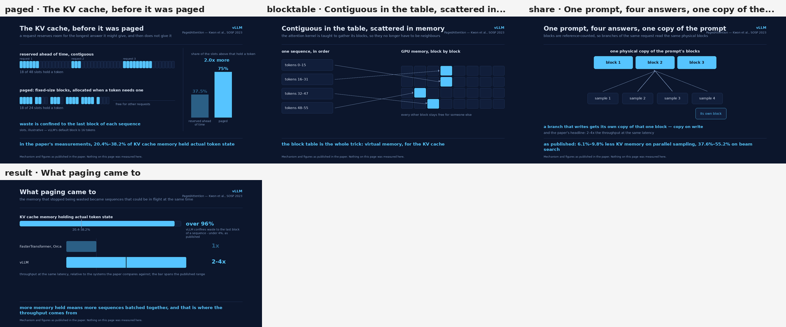
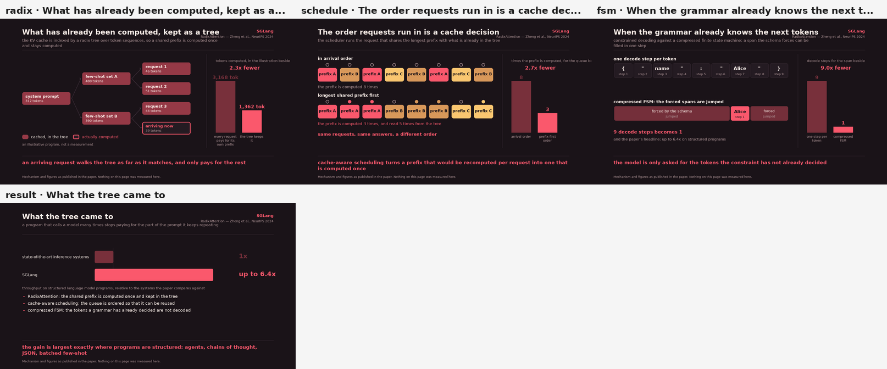
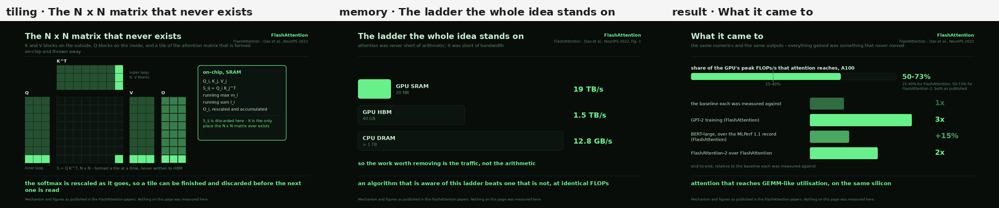
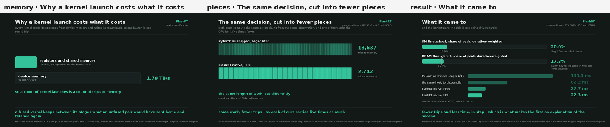

# demo-kit

Tools for recording what an optimization actually did, as a film.

Each arm runs the real model once and writes down **when** each thing happened.
A compositor then replays those timestamps and draws every frame. Nothing is
screen-captured: the robot pixels are the simulator's own observation, and every
number, bar and clock on the page is drawn from the recorded events.

That indirection is what makes the films possible at all. Arms that cannot share
a process — a serving engine bakes its module tree into a compiled decode path
at load time, so `attach` has to happen in a different process than the baseline
— still end up side by side on one wall clock.

```
demokit/
  simloop.py            the LIBERO closed loop, shared by every robot host
  record.py             one arm per process; maps --host to an adapter
  hosts/                8 host adapters (lerobot, openpi, Isaac-GR00T, native)
  pipelines/            4 recorders: Wan2.2, Qwen3-VL, Qwen3.6-35B, vLLM/SGLang
  compose/race_compose.py   stream / video / stream_batch / arch / runtime / diagram
  compose/sim_compose.py    robot panes
  compose/trips_compose.py  the one-idea film: the same work, cut into trips
  compose/styles_compose.py one recording, four visual languages
  compose/explain_compose.py a published mechanism, drawn from a spec
  compose/palettes.py       six colour systems, addressed by role
  explainers/               authored explainer specs, one per framework
  diagrams/                 authored architecture layouts, wired to entry points
  stubs.py                  satisfy an import a recording path never calls
.ai/skills/               record-a-demo, and explain-a-speedup
examples/runs/            20 real recordings; a first cut needs no GPU
adapters/
  diffusers_cli_hook.py attach inside `diffusers-cli run`, no diffusers edit
docs/PROTOCOL.md        the run-directory contract and the adapter protocols
```

## Recording one film

Install with `pip install -e .`, then record each arm in its own process and
draw them together.

```python
from demokit import hook

rec = hook.Recorder("video", label="+ FlashRT structures",
                    sub="auto_swaps, nvfp4_balance", color="ours")
with hook.on_denoiser(rec, pipe):            # stamps every denoiser call
    out = pipe(prompt=..., num_inference_steps=20)
rec.frames(frames).write("runs/wan22/attach")
```

```bash
demokit check runs/wan22/eager runs/wan22/attach    # names what would fail
demokit draw  runs/wan22 --arms eager,attach --out wan22.webm \
    --title "Wan2.2 TI2V-5B" --subtitle "480x480 · 33 frames · 20 steps"
```

## One idea, for someone who will not read a chart

A demo film shows one arm finishing first. Everyone reads it, because there
is nothing to parse. Explaining *why* is much harder, and the rule is
brutal: **one idea, and everything else is cut.**

Every CUDA kernel reads its operands from device memory and writes its result
back, so a kernel launch is a trip to memory. Both arms compute the same
decision, so both rows are drawn the same length — and one of them is cut
into five times as many pieces.

```bash
python -m demokit.compose.trips_compose --runs examples/runs/trips \
    --arms torch,fp8 --gate compiled --out why.webm
```

Same work, fewer trips, therefore more work per trip. Three claims from one
picture, no legend, and the third is a consequence of the first two rather
than a fourth thing to remember. Colour is measured too — how hard the chip
was working, from Nsight Compute.

On pi0.5, one decision on LIBERO, an RTX 5090:

| | trips to memory | one decision |
|---|---|---|
| PyTorch as shipped (LeRobot, eager, bf16) | 13,637 | 134.3 ms |
| the same host, `torch.compile` | 5,214 | 62.2 ms |
| FlashRT native, FP16 | 2,862 | 27.7 ms |
| FlashRT native, FP8 | **2,742** | **22.3 ms** |

Fewer trips and less time, in step, all the way down the ladder. That the two
columns move together is what makes the first an explanation of the second
rather than a coincidence beside it.

Four versions of this film were built and rejected before this one — each
more accurate than the last, and four of them unreadable. That record is the
useful part, and it is in
[`.ai/skills/explain-a-speedup/SKILL.md`](.ai/skills/explain-a-speedup/SKILL.md).

## Four ways to draw the same recording

Which drawing carries the idea is a real decision, and it is cheap to try
several: the recording is already on disk, so each one costs seconds.

```bash
demokit looks examples/runs/stream --sheet looks.png     # every look at once
demokit looks examples/runs/stream --style curve --palette paper --out a.webm
```



| style | what it argues |
|---|---|
| `curve` | **rate** — tokens against time, so the slope *is* the speed |
| `bars` | **finishing** — the plainest race there is |
| `dots` | **identity** — one cell per token, the same cells in every arm |
| `ribbon` | **density** — the same ticks on the same track, bunched up |

They are not interchangeable. `curve` is the one to reach for when the claim
is about rate; `dots` when the claim that matters is *the same tokens*, and
speed is the second thing the viewer notices; `bars` for an audience that
should not have to read an axis; `ribbon` when the point is that a fixed
amount of work fits into less time.

Six palettes — `midnight`, `paper`, `phosphor`, `blueprint`, `ember`, `mono`
— and a painter never names a colour. It asks for a role: the ground, the
rule, the reading text, `stock` / `compiled` / `ours` / `native`. So one flag
changes the whole film and no drawing code moves, and a light palette that
needs darker arm colours is one place to fix rather than thirty.


## Explaining a mechanism, from a paper

Not every explanation needs a recording. When the thing worth showing is an
idea someone already published — how a system decides, allocates, or caches —
the source is the paper, and the drawing is the work.

```bash
demokit explain vllm_paged     --menu menu.png               # every panel
demokit explain flashattention --palette phosphor --film fa.webm     # the film
demokit explain sglang_radix   --panel 0 --palette ember --out radix.webm
demokit explain vllm_paged     --panel 0 --sheet paged.png   # six palettes
```









`--film` puts the panels in order behind a title card, and each panel builds
in beats: the row first, then the count it comes to. A number never appears
over a row that is still being drawn, which is the same rule as everywhere
else in this kit — do not say a thing before it is true on the page.

Four specs ship. Three are drawn from papers their own authors wrote —
`vllm_paged` (PagedAttention, SOSP 2023), `sglang_radix` (RadixAttention,
NeurIPS 2024), `flashattention` (FlashAttention 1 and 2) — and one,
`flashrt_trips`, is drawn from a run measured here, which is why its source
line reads differently. Ten painters, and each is a template for a shape that
recurs well beyond the framework it was drawn for:

| painter | the shape |
|---|---|
| `paged` | a resource reserved for a worst case, versus handed out in fixed pieces |
| `blocktable` | an indirection table: contiguous to the reader, scattered underneath |
| `share` | one copy read by many, and what happens when one of them writes |
| `radix` | work kept in a tree, so a shared prefix is done once |
| `schedule` | the same queue in two orders, and what the cache makes of each |
| `fsm` | steps that had to be taken, versus steps already decided |
| `tiling` | an intermediate too big to keep, streamed instead of stored |
| `memory` | the ladder an argument stands on: what is near, and what is far |
| `pieces` | the same length of work, cut into a different number of pieces |
| `result` | what it came to: meters that fill, and the chart under them |
| `chart` | bars, ranges and a baseline line — the payoff, as a chart |

Three rules keep an explainer honest, and they are the recording rules pointed
at a different source:

- **Every number is the paper's, and the page says so.** The spec carries a
  `source` line; it is printed on every panel and there is no way to draw one
  without it.
- **Nothing here is measured.** A claim that would need a measurement is a
  claim that should have been a recording.
- **An illustration says it is one.** Where a picture needs a concrete
  scenario, the panel labels it, so it is never mistaken for data. And every
  count a panel prints — slots held, decode steps, prefix computations — is
  derived from the spec, so a changed scenario cannot leave a stale number
  typed into a caption.

**Say what it came to, on the page that says what was done.** A number on its
own page is a number nobody connects to anything; "6.4x" in 60-point type is a
token to read, not a length to see. So every mechanism panel can carry a bar
chart in its right-hand column, and the diagram shrinks to make room:

```json
"chart": {"side": true, "derive": "radix_tokens",
          "labels": ["every request pays for its own prefix",
                     "the tree keeps it"],
          "axis": "tokens computed, in the illustration beside"}
```

`derive` is the important word. The chart beside a diagram is **computed from
that diagram** — the tokens in the drawn tree, the queue in the drawn cards,
the slots in the drawn strip — so the picture and the number cannot drift
apart, and editing the scenario moves both. Charts on a results page carry the
paper's figures instead, each with a baseline bar at 1x so a multiple is a
length rather than a claim; a published *range* is drawn to its upper end with
the lower end marked, because a range is not a point.

Where the honest answer is *that a number barely moved* — FlashRT's
utilisation is 17.8% against 20.0%, and the win is elsewhere — the meter says
so, because a page that hid that would be selling something.

A framework is a spec, not a patch. Copy one of the four, keep the painters,
and the menu redraws.


## Lighting an architecture diagram

`hook.on_components` draws the framework itself — not the model — and lights
it from a run.

```python
rec = hook.Recorder("diagram", label="the same host, structures attached")
with hook.on_components(rec, "flashrt"):
    attach_and_run()
rec.write("runs/doors/attach")
```

The layout is authored, in `demokit/diagrams/*.json`: a picture of a system is
a human judgement and pretending otherwise makes a worse picture. What lights
up is not. Each box names the entry point it stands for, and turns on when
that entry point is actually called, in the order it is called.

Drawn beside a baseline, the dark boxes carry as much as the lit ones: an
eager arm lights the host and nothing under it, which is the honest picture of
an eager arm and is not something a bar chart can say.

## Recording what the runtime did

A demo film says which arm finished first. `hook.on_kernels` says what each
one asked the GPU to do to get there — every CUDA kernel that ran, in the
order it ran, bucketed by what it was for and whose code it was.

```python
rec = hook.Recorder("runtime", label="+ FlashRT structures", color="ours")
with hook.on_kernels(rec):
    model(**inputs)
rec.write("runs/wan22_runtime/attach")
```

One instrument covers every form, because a profiler records the kernel that
ran and does not care who launched it: eager PyTorch, an inductor-generated
Triton kernel, a FlashRT seam, or a native pipeline that never enters torch.
Drawn side by side, an eager arm spending most of the GPU moving operands and
a compiled arm that fused that away are visible without a word of commentary.

The pane carries counts and kernel names, which are structural. It carries no
timing: the profiler perturbs the run it watches, and the demo films are where
speed belongs. And it does not treat a smaller number as a better one — an arm
can launch more kernels than its baseline and still finish first, because it
made each of them cheaper.

## Recording the architecture

`hook.on_tree` records the model's own module tree and one real pass through
it: nodes from `named_modules()`, order from the order the forward hooks first
fired. Recorded after an attach, `hook.seats` joins the structures receipt onto
that tree by module path — so each node says what FlashRT put in it, whether it
truly ran, and, where a seam was turned down, the ledger's reason.

```python
rec = hook.Recorder("arch", label="the same tree, after attach", color="ours")
with hook.on_tree(rec, model, depth=4):
    run_one_pass()
hook.seats(rec, handle.report(),
           refused=[{"path": p, "reason": why} for p, why in refusals])
rec.write("runs/arch/attach")
```

Draw it beside the same tree recorded without FlashRT in the process and the
distribution layer is visible rather than described. The pane carries no
performance figure: one forward pass is milliseconds, so the recorder stretches
the timestamps to make it watchable and says so on its face.

Robot policies have their own path, because the LIBERO loop is shared:

```bash
python demokit/record.py --host lerobot_pi05 --arm eager \
    --suite libero_spatial --task-id 0 --trial 0 --out runs/pi05_race/eager
python demokit/compose/sim_compose.py --runs runs/pi05_race --out pi05_race.webm
```

## Installing the agent skill

```bash
demokit skills add                      # ~/.claude/skills and ~/.agents/skills
demokit skills add --project .          # into this repository instead
demokit skills add --agents-md ~/.codex/AGENTS.md   # also leave a pointer
demokit skills where                    # print the targets without writing
```

Agents disagree about where a skill lives. Claude Code reads
`~/.claude/skills/<name>/SKILL.md`; several others read
`~/.agents/skills/<name>/`; Codex reads `AGENTS.md`. `add` writes the skills
directories, and `--agents-md` appends a pointer to an `AGENTS.md` for the
agents that only read that. It is idempotent — a second run says the pointer is
already there rather than duplicating it.

## Examples

`examples/runs/` carries one real film per painter kind — the actual recorded
events, with pixels subsampled or truncated only where a file would otherwise
be too large for a repository (each says so in its own `_example_note`).

```bash
demokit check examples/runs/*/*                          # 20/20 ready to draw
demokit draw  examples/runs/stream       --out /tmp/a.webm   # a VLM, 3 arms
demokit draw  examples/runs/video        --out /tmp/b.webm   # Wan2.2, 2 arms
demokit draw  examples/runs/stream_batch --out /tmp/c.webm   # vLLM at batch 8
demokit draw  examples/runs/loop         --out /tmp/d.webm   # GR00T, 60 steps
demokit draw  examples/runs/arch         --out /tmp/e.webm   # the tree inside vLLM
demokit draw  examples/runs/runtime --arms eager,compiled,attach \
                                        --out /tmp/f.webm   # 3 runtimes, one call
demokit draw  examples/runs/doors   --arms eager,attach \
                                        --out /tmp/g.webm   # the diagram, lit
python -m demokit.compose.trips_compose --runs examples/runs/trips \
    --arms torch,fp8 --gate compiled --out /tmp/h.webm      # why it is fast
```

They are also the answer to "do I need to run the model?" — usually not. A run
someone else recorded draws exactly as well as one you made.

`examples/specs/` holds the multi-chapter specs behind the published films.

## Handing this to an agent

```bash
demokit skills add                      # ~/.claude/skills and ~/.agents/skills
demokit skills list
```

Two skills. `record-a-demo` covers making the film that shows an optimization
worked. `explain-a-speedup` covers the harder one — saying why — and most of
it is a record of the versions that failed and the reason each was
unreadable, because that judgement is what a first draft gets wrong.

Both lean on `examples/runs/`: a first cut needs no model and no device, and
redrawing costs seconds because `events.json` is the whole raw material.
Ten drafts is normal, and the loop that works is to render one frame, look at
it, and cut something.

## Adding a model

Read [`docs/PROTOCOL.md`](docs/PROTOCOL.md), or hand an agent
[`.ai/skills/record-a-demo/SKILL.md`](.ai/skills/record-a-demo/SKILL.md).

- **a diffusers / transformers host** — one `hook.Recorder` and one `with`
  block. No new script.
- **its architecture** — `hook.on_tree` takes any `nn.Module`. Containers,
  repeated stacks and engines that own their own model tree all read the same
  way.
- **a robot policy** — one host adapter plus one branch in
  `record.py:build_host()`; the loop, the timing and the event writing are done.
- **something with no hook yet** — call `rec.stamp(...)` where the thing
  arrives. That is all a hook does.

## Rules the recorders follow

These came from getting them wrong first, and they are why the numbers hold up.

- **One arm per process.** Two arms in one process share allocator state and
  clocks.
- **Report TTFT and decode separately.** Never blend them into one end-to-end
  number.
- **Two baselines**: the host as shipped, and the host after `torch.compile` +
  graph capture. The gate is the compiled one.
- **Headline is a median.** min-of-N is a lower bound in a footnote, never the
  number on the page.
- **Score parity against the original baseline**, never against an intermediate
  arm.
- **Real inputs.** Random tensors hide calibration bugs.
- **A refusal is a result.** A seam that does not pay is recorded with its
  reason, not dropped.
